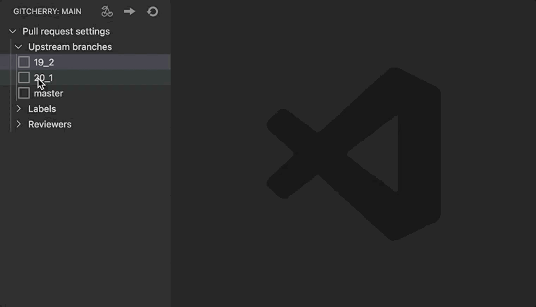
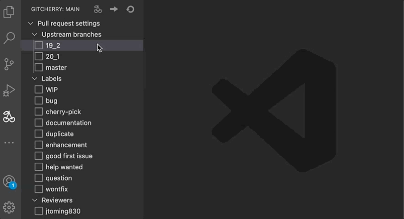
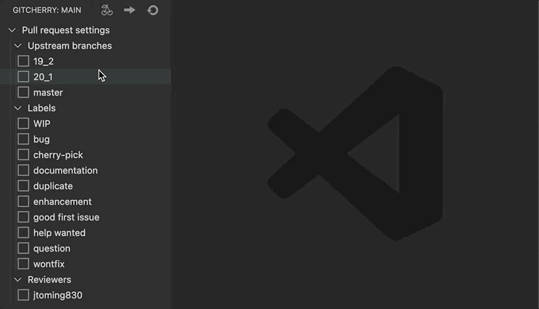

# GitCherry

[GitCherry](https://github.com/ksercs/GitCherry.git) is an open-source extension for [Visual Studio Code](https://code.visualstudio.com/) created by [Anton Kuznetsov](https://github.com/ksercs) and [Jaan Toming](https://github.com/jtoming830) to automate routine processes of cherry-picking and pull requests creating.

## Main features:

1. One-click [cherry-pick to multiple branches](##cherry-pick-to-multiple-branches)
2. One-click [multiple pull requests with custom configuration creating](##multiple-pull-requests-creating)

### some more:

- [merge conflicts solving](###merge-conflicts-solving)
- [abort cherry-pick when merge conflict is detected](###abort-cherry-pick-when-merge-conflict-is-detected)
- [data tree refreshing](###views-refreshing0)

## Cherry-pick to multiple branches

  

0. Create a local branch named as `*name__upstreamBranchName*`, etc `myBranch_master`. Commit changes.
1. Toggle checkboxes with appropriate branch names to specify necessary upstream branches to which cherry-pick.
2. Click `Cherry-pick` button to start cherry-picking.

**Result**: Local branches with commits cherry picked from current one are created.

### Merge conflicts solving

  

0. If merge conflict is detected cherry picking stops, `Cherry-pick` button replaces with `Continue cherry-picking` button.
1. Resolve merge conflict using familiar way and commit the changes.
2. Press `Continue cherry-picking` button.

**Result**: Cherry-picking continues.

### Abort cherry-pick when merge conflict is detected

  

Click on `Abort cherry-pick` button when merge conflict is detected to cancel current cherry-pick.

**Result**: actual cherry-pick is aborted.

## Multiple pull requests creating

  

1. Select branches. Select labels and reviewers if it's necessary.
2. Click on the `Create pull requests` button.
3. Customize a title in the shown input box (by default first commit message is placed here). Input some description if you want.

**Result**: Local branch named as `*currentBranch__upstreamBranch*` is pushed for every selected upstream branch. And for every pushed branch customized pull request is created. It remains only to click on `Open` button placed in the information toast to see pull request github page.

### Data tree refreshing

  

Extension data tree can become outdated if some new labels, branches or reviewers were added to upstream repo.

Click on `Refresh` button to load new data and update the tree.

## Details and future plans

See [CHANGELOG](./CHANGELOG.md)